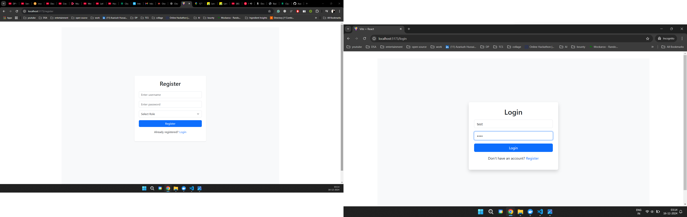
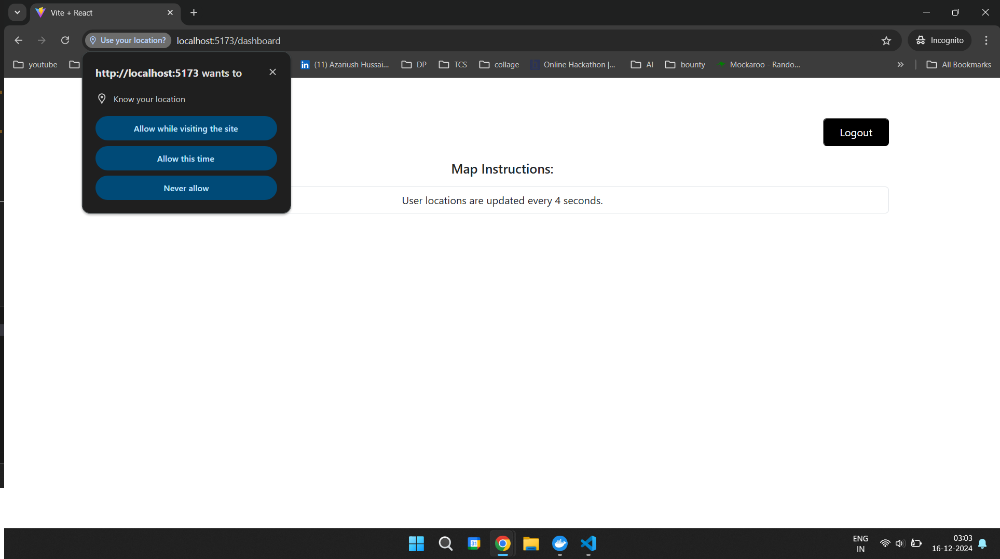
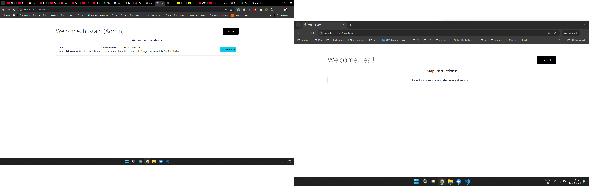
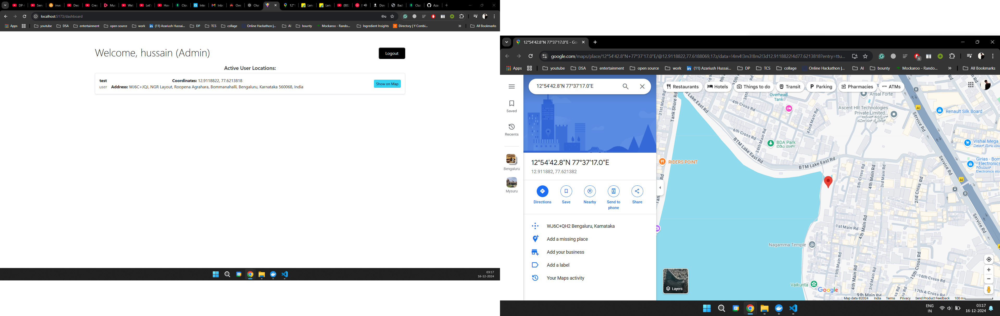

# Real-Time GPS Tracker Backend

A scalable backend system to track the live location of users in real-time. This backend handles user location pings sent every 4 seconds and includes features for user registration, login, and an admin interface for monitoring user data. The system is built using a **Pub/Sub architecture** to efficiently handle real-time updates and scale for high user concurrency.

---

## Features

### User Features
- **Registration & Login:** Users can securely register and log in.
- **Real-Time Location Tracking:** Tracks users' GPS locations and updates the server every 4 seconds.
- **Scalability:** Designed to handle high user traffic simultaneously.

### Admin Features
- **User Monitoring:** Admin interface to view all registered users.
- **Location Logs:** Admins can view detailed location logs for individual users.

---

## Technical Stack

### Core Stack
- **Backend:** Node.js with Express.
- **Database Options:**
  - **NoSQL Database (MongoDB):** For flexible storage of location data.

### Optimization Tools
- **Redis:** Used for caching frequently queried data and optimizing real-time performance.
- **Pub/Sub Architecture:** Real-time data flow is handled through a Publish/Subscribe mechanism for efficient communication.

---

## Installation

### Prerequisites
- Node.js installed on your machine.
- MongoDB database set up.
- Redis installed (for Pub/Sub and caching).

### Steps
- Clone the repository:
  ```
  git clone https://github.com/AzariushHussain/realtime-gps-tracker.git
  cd realtime-gps-tracker
  ```
- Set up the backend:
```
# Navigate to the backend directory:
  cd backend
# Install dependencies:
  npm install
```
- Create a .env file in the backend directory and configure the required variables.
- Set up the frontend:
```
# Navigate to the frontend directory:
  cd frontend
# Install dependencies:
  npm install
```
- Create a .env file in the frontend directory and add your Google Maps API key.

- Start the backend and frontend server.

## Environment Variables

### Backend Environment Variables
Create a `.env` file in the backend directory and define the following environment variables:
```env
PORT=8000
MONGODB_URI=mongodb+srv://<username>:<password>@cluster0.taggt.mongodb.net/<database_name>?retryWrites=true&w=majority
POSTGRES_URI=postgres://<username>:<password>@<host>:<port>/<database_name>?sslmode=require
REDIS_URI=redis://localhost:6379
JWT_SECRET=your_jwt_secret_key
TOKEN_EXPIRATION=30d
```

### Frontend Environment Variables
Create a .env file in the frontend directory and define the following environment variable:
```env
VITE_GOOGLE_MAPS_API_KEY=your_google_maps_api_key
```

### Demo:

- Login and register page
  
  

- After a user logs in permission is asked before capturing data
  
  

- Above is the interface for admin and user, where the admin can see the live locations of all the logged-in users.
  
  

- Upon clicking the 'Show on map' button, the admin is redirected to Google Maps where he/she can see the location on the map.
